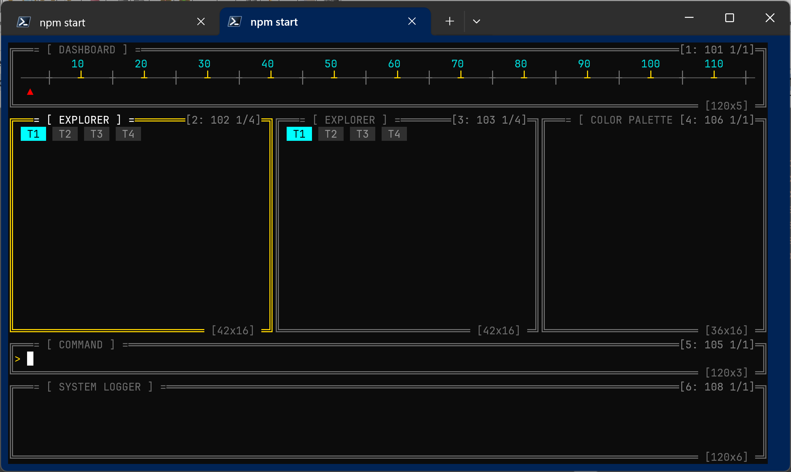

# АРХИТЕКТУРНЫЙ МАНИФЕСТ ПЛАТФОРМЫ: SLOTCMP III (СЛОТ-КОМПОЗИТОР [GEN. III])
## Ревизия: #0820-ULTRA-REACTIVE-DOD-STABLE
---

## 🛑 1. 4 СУВЕРЕННЫХ ЗАПРЕТА (0% САХАРА)

Для достижения абсолютного мономорфизма и максимальной производительности в рантайме V8 TurboFan, на уровне ядра платформы slotcmp III действуют четыре непреклонных архитектурных запрета:

* **0% OOP (Полный отказ от объектно-ориентированного сахара)**
  Запрещено использование ключевых слов `class`, `new`, `extends` и прототипного наследования. Память под данные выделяется в виде анемичных плоских структур через функциональные фабричные литералы или метод `Object.create(null)`. Все созданные структуры намертво запечатываются системным вызовом `Object.preventExtensions()` до входа в первый вычислительный такт.
* **0% try/catch (Исключение логических перехватов)**
  Использование блоков `try/catch` в основном логическом слое ядра, хоста и приборов полностью запрещено. Это предотвращает деоптимизацию контекста выполнения компилятором TurboFan. Единственное легитимное исключение — изолированный фоновый воркер дискового ввода-вывода (`vfs_worker.js`), где перехват необходим для изоляции сбоев операционной системы. Санитарный контур терминала на выходе из функции `main` выведен во внешний периметр.
* **0% RegExp (Побайтовая векторизация потока)**
  Полный запрет использования регулярных выражений, а также методов `.match()`, `.test()` и `.replace()`. Любой разбор текстовых конфигураций, ANSI-последовательностей и пакетов SGR-мыши выполняется исключительно посимвольно или побайтово через прямые сопоставления ASCII-кодов и логические вентили. Векторизация выполняется in-place.
* **0% Polling (100% Реактивные прерывания)**
  Абсолютный запрет на использование холостого хода `setInterval`. Ядро платформы slotcmp III пассивно и потребляет 0% ресурсов центрального процессора вне моментов наступления физических событий. Рантайм просыпается строго реактивно по аппаратному прерыванию операционной системы: от изменения размеров окна (`resize` в `process.stdout`) или падения байт в буфер ввода (`data` в `process.stdin`).
---

## 🎛️ 2. СИСТЕМНЫЙ КОНТУР МЫШИ И ФОКУСА (СЛОТ 10)

В рамках генерации III платформы slotcmp зафиксировано жесткое разделение адресного пространства СМО-приборов:
* **Диапазон 0–99**: Зарезервирован под служебные инфраструктурные приборы ядра.
* **Диапазон 100+**: Отведен под пользовательские интерактивные бизнес-панели (слоты).

### Механика работы системного Слота 10 (`mouse_worker_unit.js`):
1. **Захват прерывания**: Низкоуровневый посимвольный автомат ввода `tty_byte_scanner.js` перехватывает SGR-пакеты, декодирует коды кнопок и выстреливает тактовый транзакт прерывания `generateGpssTransaction` строго на системный **Слот 10**.
2. **Прецизионный хит-тест**: Внутренний продвигатель Слота 10 (`advanceMouseQueueFacility`) извлекает транзакты из FIFO-очереди и выполняет сквозной обход глобальной ОЗУ-карты флекс-геометрии окон (`calculatedGeoMap`).
3. **Рокировка фокуса и рендер**: Если координаты клика попадают внутрь границ неактивной бизнес-панели, Слот 10 атомарно перезаписывает регистр `focusedSlotId` в ОЗУ ядра хоста, принудительно инвалидирует теневой холст (`forceInvalidateShadowCanvas`) для перерисовки рамок окон золотым цветом фокуса и пробрасывает относительные координаты клика внутрь целевой панели для прикладной обработки.

---

## 🧬 3. ЧЕТЫРЕ ФУНДАМЕНТАЛЬНЫХ ТИПA ПРИБОРОВ СМО

Вся вычислительная мощность платформы распределена строго по четырем суверенным классам приборов, взаимодействующих через импульсную шину прерываний `bus.js`. Выделение памяти под структуры внутри такта запрещено.

1. **СИНХРОННЫЕ ПРИБОРЫ ОБСЛУЖИВАНИЯ (`sync`)**
   * **Назначение**: Прикладные интерактивные бизнес-панели отображения данных (100+).
   * **Представители**: `command_ctl.js` (Слот 105), `dashboard_ctl.js` (Слот 101), `theme_ctl.js` (Слот 106), `logger_ctl.js` (Слот 108), `explorer_ctl.js` (Слоты 102/103).
   * **Поведение**: Мгновенно реагируют на прикладные транзакты, мутируют локальные анемичные модели данных и перерисовывают внутренние UHD-матрицы окон знакомест в рамках одного синхронного такта.
2. **АСИНХРОННЫЕ ПРИБОРЫ ОБСЛУЖИВАНИЯ (`async`)**
   * **Назначение**: Системные инфраструктурные контроллеры хоста.
   * **Представители**: `root_unit.js` (Слот 0), `resize_unit.js` (Слот 9).
   * **Поведение**: Координируют фазы холодного бутстрапа ядра и гидратации интерфейса. Не блокируя Event Loop, упаковывают метрики прерываний в запечатанные стейт-пакеты и асинхронно делегируют задачи расчета сеток разметки на внешние воркеры.
3. **СИНХРОННЫЕ ПРИБОРЫ АППАРАТНЫХ ПОТОКОВ (`thread sync`)**
   * **Назначение**: Низкоуровневые буферы-приёмники физических событий ввода ОС (0-99).
   * **Представители**: `keyboard_worker_unit.js` (Слот 4), `mouse_worker_unit.js` (Слот 10).
   * **Поведение**: Связаны напрямую с аппаратными прерываниями ввода ConPTY. Аккумулируют сырые байты, нормализуют управляющие токены клавиш и мыши, сохраняют их в локальных FIFO-очередях и проталкивают каретку шины вперед.
4. **АСИНХРОННЫЕ ПРИБОРЫ АППАРАТНЫХ ПОТОКОВ (`thread async`)**
   * **Назначение**: Фоновые изолированные вычислители и воркеры ввода-вывода.
   * **Представители**: `layout_worker.js`, `vfs_worker.js`, `animation_worker.js`.
   * **Поведение**: Работают в изолированных потоках `Worker Threads` в парадигме "Zero Allocation". Принимают IPC-задачи через межпоточный шлюз `worker_gateway.js`, выполняют расчеты флекс-координат или обращаются к диску, после чего возвращают результирующий транзакт в главное ядро хоста.

---

## 🎨 4. ГИБРИДНЫЙ КОМПОЗИТОР И ДВОЙНАЯ БУФЕРИЗАЦИЯ

Презентационный контур платформы slotcmp III реализует концепцию Квантового TUI-Движка и разделен на 3 жесткие фазы:

* **Фаза А: Реактивный захват прерывания**
  Событие от ОС мгновенно будит шину прерываний, продвигая системные приборы ввода (Каналы 4 и 10).
* **Фаза Б: Синхронное квантование и Рендеринг**
  Прибор Отрисовки (Канал 1) продвигается шиной гарантированно последним. Он осуществляет последовательный вызов прикладных TUI-рендереров, выстраивая текстовые растры внутренних сеток окон, и накатывает Unicode-контур стальных двойных рамок поверх матриц.
* **Фаза В: Дифференциальный Blit-перенос**
  Модуль `flusher.js` реализует концепцию грязного пикселя (**Dirty Cell**) и двойной буферизации. Вместо использования деструктивных мерцающих команд очистки экрана (`\x1b[2J`), он попиксельно сопоставляет UHD-матрицу текущего кадра с теневым буфером ОЗУ прошлого шага. Сформированная строковая дельта изменений аккумулируется в единый байтовый массив и атомарно выжигается в дескриптор терминала через прямой системный вызов `fs.writeSync(1)`, полностью исключая мерцание кадра при интерактивных нагрузках.
```text
========================================================================================
                      ПРИНЦИПИАЛЬНАЯ СХЕМА ЯДРА SLOTCMP III
========================================================================================

    [Аппаратное прерывание ОС] (resize)       [Аппаратное прерывание ОС] (stdin)
                 │                                         │
                 ▼                                         ▼
         (process.stdout)                          (process.stdin)
                 │                                         │
                 ▼                                         ▼
        [ Слот 9: RESIZE ]                      [ tty_byte_scanner.js ]
          Type: `async`                          (Побайтовый ANSI-разбор)
                 │                                   │              │
                 │ (Запрос разметки)                 │ (Клавиши)    │ (SGR-мышь)
                 ▼                                   ▼              ▼
       ┌───────────────────┐               [ Слот 4: KBD ]   [ Слот 10: MOUSE ]
       │  worker_gateway   │               Type: `thread sync` Type: `thread sync`
       └─────────┬─────────┘                         │              │
                 │                                   │              │
    (IPC)        ▼                                   ▼              ▼
 ┌───────────────────────────────┐              (Выстрел тактового транзакта)
 │ [ layout_worker.js ]          │                   generateGpssTransaction()
 │ Type: `thread async`          │                                │
 └───────────────┬───────────────┘                                ▼
                 │                                    ┌───────────────────────┐
                 ▼ (Инжекция карты)                   │    РЕАКТИВНАЯ ШИНА    │
         [ Слот 0: ROOT ] ◄───────────────────────────┤        СМО СЛОТОВ         │
          Type: `async`                               │       (bus.js)        │
                 │                                    └───────────┬───────────┘
                 │ (Рефреш)                                       │
                 ▼                                                ▼
       ┌──────────────────────────────────────────────────────────────────────┐
       │ БИЗНЕС-СЛОТЫ ПАНЕЛЕЙ (Type: `sync`)                                  │
       │ [ Слот 101: Dashboard ]   [ Слот 102/103: Explorer ]                 │
       │ [ Слот 105: Command ]     [ Слот 106: Theme ]   [ Слот 108: Logger ] │
       └──────────────────────────────────┬───────────────────────────────────┘
                                          │
                                          ▼ (Тактовое продвижение очередей)
                               ┌──────────────────────┐
                               │  [ Слот 1: RENDER ]  │
                               │    Type: `async`     │
                               └──────────┬───────────┘
                                          │
                                          ▼ (Сборка UHD-матриц кадра)
                               [ synchronizeDisplayTree ]
                                          │
                                          ▼ (Дифференциальный ANSI-diff)
                                [ flushVirtualCanvasToTty ]
                                          │
                                          ▼ (Атомарное выжигание 0% Polling)
                                   fs.writeSync(1)

```


## ЗАКЛЮЧЕНИЕ

Освоение представленного лабораторного цикла позволяет студентам перейти от интуитивного (ООП-ориентированного) написания кода к строгому инженерному проектированию высокопроизводительных систем. Применение аппарата Теории систем массового обслуживания (СМО) Кудрявцева в сочетании с парадигмой Data-Oriented Design (DOD) доказывает, что управляемый реактивный рантайм (Node.js / V8) способен работать со скоростью компилируемых низкоуровневых сред, если в куче ОЗУ полностью ликвидирован мусор и обеспечен 100% мономорфизм скрытых классов (Hidden Classes).

Разработанный в ходе выполнения работ СМО-движок **slotcmp III (генерация III)** демонстрирует абсолютную устойчивость к деоптимизации TurboFan, нулевую нагрузку на процессор (0% CPU) в режиме ожидания прерываний ОС и открывает безграничные возможности для безаварийной горячей рокировки (Hot Swap) бизнес-компонентов непосредственно «на лету» в памяти. Полученные знания являются базовым фундаментом для создания современных отказоустойчивых распределенных комплексов и систем реального времени.

---

## СПИСОК РЕКОМЕНДУЕМОЙ ЛИТЕРАТУРЫ

1. **Кудрявцев Е. М.** *GPSS World.GPSS World. Основы имитационного моделирования различных систем*. 
2. **Кудрявцев Е. М.** *Исследование операций в задачах, алгоритмах и программах*. — М.: Радио и связь, 1984. — 184 с. 
3. **Gordon G.** (Syracuse University, NY, USA). *The Development of the General Purpose Simulation System (GPSS)*. — ACM SIGPLAN Notices, 1978. Vol. 13, No. 8. — pp. 183–198. (Исторический и теоретический манифест создания первой в мире транзактной СМО-системы от её автора).
4. **Gordon G.** *System Simulation*. — 2nd ed. — Englewood Cliffs, NJ: Prentice-Hall, 1978. — 303 p. (Классический учебник профессора Джеффри Гордона по векторизации имитационных сред и теории очередей).
5. **ECMA International.** *ECMA-262: ECMAScript® 2026 Language Specification*. — Geneva, 2026. (Официальная спецификация стандартов типов рантайма, Hidden Classes и механизмов preventExtensions).

=======


